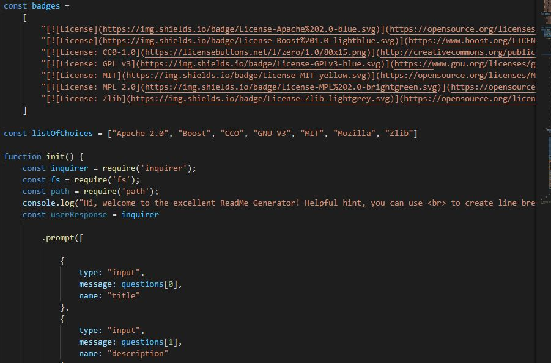
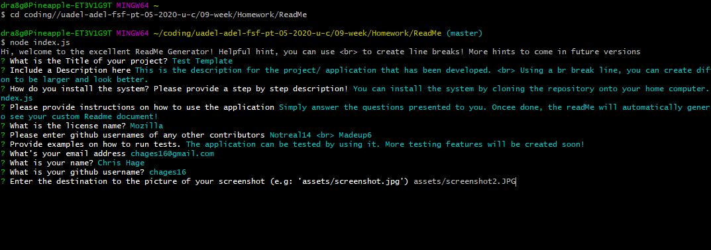
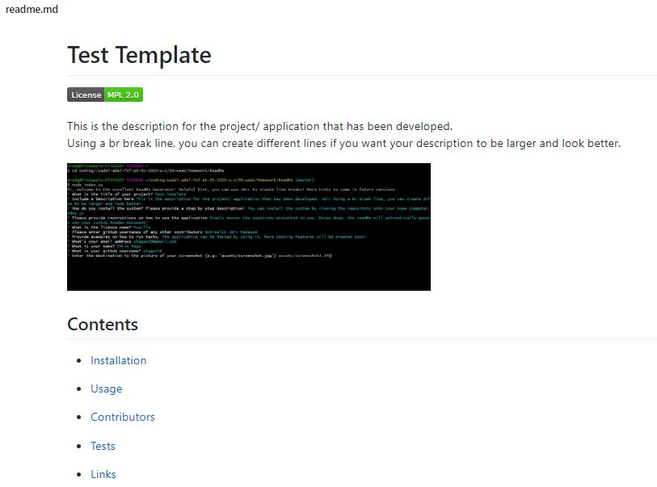

# ReadMe Generator

This ReadMe generator is a simple yet effective application that allows a user to respond to several questions regarding their project, in order to create a basic Readme.md file. The generator includes the ability to link to Github, add a link to a screenshot and choose from a list of pre-defined licenses, so that the user can very quickly create a complete readme document.
            





*  [Readme Gen Application](https://drive.google.com/file/d/17AdgUDWj6dWiq4Mbs5gCO915-1NGk0bg/view)          
*  [ReadMe Gen Repository](https://github.com/chages16/ReadMe)
*  [ReadMe Example](https://github.com/chages16/ReadMe/tree/master/generatedreadme)

 ## Contents
            
* [User-Story](#User-Story)
            
* [Installation](#Installation)
            
* [Technology](#Technology)
            
* [Challenges](#Challenges)
            
* [Version](#Version)
            
* [Future-Development](#Future-Development)

* [Credits](#Credits)

## User-Story
```
AS A developer
I WANT a README generator
SO THAT can quickly create a professional README for a new project
```

## Installation
            
You can install the system by cloning the repository onto your home computer. Then from the root folder, type node index.js  Simply answer the questions presented to you. Oncee done, the readMe will automatically generate. Open the generatedcontent folder to see your custom Readme document!

## Technology

* [NPM Inquirer](https://www.npmjs.com/package/inquirer)

* [Node.js](https://nodejs.org/en/)

* [Visual Studio](https://code.visualstudio.com/)


## Challenges
Being new to Inquirer, it took me sometime to understand the syntax and ways to get the information on the screen to display correctly. I had some issues with the "fs" functions and was unable to find a way to get the file to successfully open after it had been created.

Currently this version of the project creates a readme document in the generatedcontent folder. Any new readme document automatically writes over the last one. I'd like to work on a way to ensure that the geneartor creates a new file in the future, or has an extra confirm option presented to ensure that a user if properly aware that generating a readme will write over their previous work.


## Version
1.0.0


## Future-Development
* More licenses added to the license list
* An open file option at the end of the application so that the user can make further changes
* More customisation options. Etc. options to add/ remove sections from the template
* Functionality to protect the last generated readme document (eg. a warning/ option to create a new readme rather than overwrite the existing one)


## Credits
* [Chris Hage](https://github.com/chages16)
