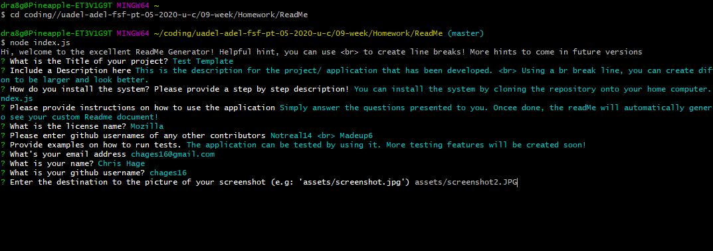

# Test Template 
            

            
 This is the description for the project/ application that has been developed.   Using a br break line, you can create different lines if you want your description to be larger and look better.
            

            
 ## Contents
            
* [Installation](#Installation)
            
* [Usage](#Usage)
            
* [Contributors](#Contributors)
            
* [Tests](#Tests)
            
* [Links](#Links)
            
* [Questions](#Questions)
            
 ## Installation
            
 You can install the system by cloning the repository onto your home computer. Then from the root folder, type node index.js
            
 ## Usage
            
 Simply answer the questions presented to you. Oncee done, the readMe will automatically generate. Open the generatedcontent folder to see your custom Readme document!
            
 ## Contributors
            
 Notreal14   Madeup6
            
 ## Tests
            
 The application can be tested by using it. More testing features will be created soon!
            
 ## Links
            
 [Test Template Application](https://drive.google.com/file/d/17AdgUDWj6dWiq4Mbs5gCO915-1NGk0bg/view)
            
 [Test Template Repository](https://github.com/chages16/ReadMe)
            
 ## Questions 
            
 [Chris Hage](https://github.com/chages16)
            
 If you have any problems or questions about the application please contact me via email on chages16@gmail.com
            